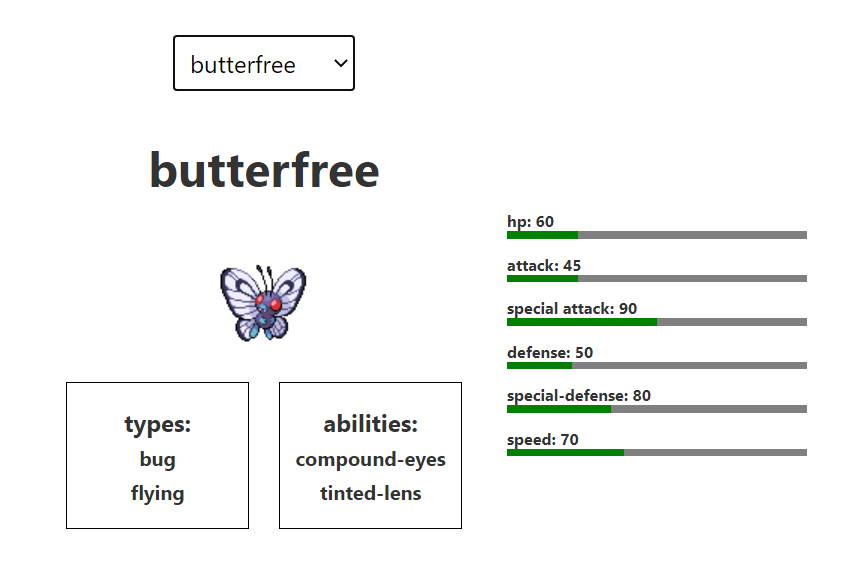

## rendition of poke_viewer_1.0 for browser users

Similar to my previous poke_viewer project this allows anyone interested in pokemon to have a lightweight introduction into the franchise. The viewer allows users to select from a list of 152 pokemon and view their abilitites, types, stats and sprite.

## Instructions to install
- Install node js -> https://nodejs.org/en/
- Clone this git onto your local machine
- cd into the poke_viewer_js folder
- run `npm install`

## Instructions to test application
- run `npm run dev`
- visit `localhost:5000` in a browser of your choice

## Instructions to build application
- run `npm run build`

## live link
http://pokeviewerjs.s3-website-ap-southeast-2.amazonaws.com/

## preview
